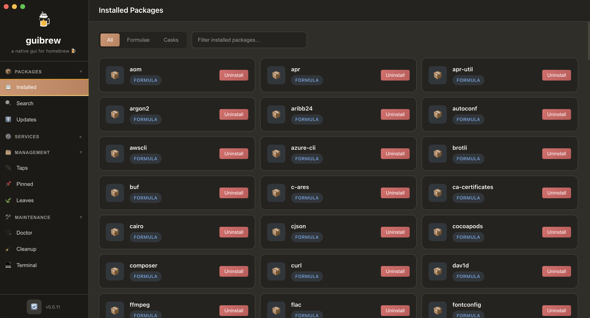

# GuiBrew 🍺

A native GUI for Homebrew - the missing package manager for macOS.



## About

GuiBrew is a modern, elegant desktop application that provides a graphical interface for managing Homebrew packages on macOS. No more terminal commands - manage your packages with a beautiful dark-themed UI.

## Features

### Package Management
- View all installed formulae and casks
- Search and install new packages from Homebrew
- Uninstall packages with one click
- View detailed package information
- Check package dependencies and dependents

### Updates
- Check for outdated packages
- Upgrade individual packages or all at once
- Update Homebrew itself with one click

### Services
- List all Homebrew services
- Start, stop, and restart services
- View service status in real-time

### Management
- **Taps** - Add and remove Homebrew repositories
- **Pinned** - Pin packages to prevent automatic upgrades
- **Leaves** - View packages not required by other packages

### Maintenance
- **Doctor** - Run `brew doctor` to diagnose issues
- **Cleanup** - Remove old versions and clear cache
- **Autoremove** - Remove unused dependencies
- **Terminal** - Run any custom brew command

## Installation

### Prerequisites
- macOS with [Homebrew](https://brew.sh) installed
- Node.js 18 or higher

### Setup

```bash
# Clone the repository
git clone https://github.com/encryptedtouhid/GuiBrew.git

# Navigate to the directory
cd GuiBrew

# Install dependencies
npm install

# Run the application
npm start
```

## Tech Stack

- **Electron** - Cross-platform desktop application framework
- **Node.js** - JavaScript runtime
- **Vanilla JavaScript** - No heavy frameworks
- **Custom CSS** - Modern dark theme

## Theme

GuiBrew features a carefully crafted dark theme:
- Base color: `#312E28`
- Accent color: `#D4956F`
- Clean, modern UI with smooth animations

## Project Structure

```
GuiBrew/
├── src/
│   ├── main.js              # Electron main process
│   ├── preload.js           # Secure IPC bridge
│   ├── services/
│   │   └── brewService.js   # Homebrew CLI wrapper
│   └── renderer/
│       ├── index.html       # Main UI
│       ├── styles.css       # Styling
│       └── renderer.js      # UI logic
├── assets/
│   └── icons/               # App icons
├── package.json
└── README.md
```

## Contributing

Contributions are welcome! Feel free to submit issues and pull requests.

## License

MIT License - feel free to use this project for personal or commercial purposes.

## Author

Made with ❤️ for the Homebrew community
